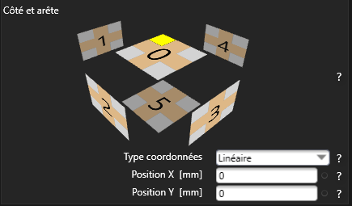
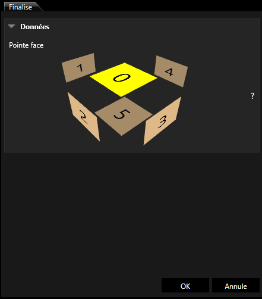

[bsuite_guide.md](https://github.com/user-attachments/files/24792386/bsuite_guide.md)
# Bsuite : Maîtriser les règles d'usinages automatiques

**Auteur :** Louis Lempin  
**Contact :** Louis.lempin2004@gmail.com

---

## Introduction

Lors de ma découverte de la fonctionnalité d'usinages automatiques dans Bsuite, j'ai constaté un manque flagrant de documentation. Malgré des recherches approfondies sur Google, Reddit et autres forums spécialisés, aucune ressource complète n'existait sur le sujet.

J'ai donc dû développer mes propres méthodes et créer ce guide pour partager mes découvertes avec la communauté des opérateurs CNC et programmateurs Biesse.

---

## À propos de Bsuite

Bsuite est le logiciel de programmation pour machines CNC Biesse. La fonctionnalité d'usinages automatiques permet de configurer des règles qui détectent automatiquement les géométries (rectangles, cercles, lignes) sur un panneau et appliquent les usinages appropriés selon des conditions prédéfinies.

**Principe de fonctionnement :**
- Le logiciel détecte les géométries lors de l'importation du fichier
- Les règles d'usinages automatiques sont appliquées selon l'ordre dans l'arbre des opérations
- Chaque usinage peut être modifié manuellement après application

## Création d'une nouvelle configuration

**Etape préliminaire: Créer une nouvelle configuration**

Avant de pouvoir créer vos règles d'usinages automatiques, vous devez d'abord créer une configuration:

1. Cliquez sur la première icône (Nouvelle configuration) 

**Interface de gestion des usinages automatiques**

Une fois votre configuration créée, vous accédez à l'interface principale des usinages automatiques, organisée en trois zones distinctes:


**Partie supérieure : liste des règles**

   Cette zone affiche toutes les règles d'usinages automatiques que vous avez créées. Chaque ligne représente une règle.

**Partie Inférieure gauche : détail de la règle**

  Lorsque vous sélectionnez une règle dans la liste, cette zone affiche:
  
- Paramètres : Géométrie, usinage, description, layer
- Géométrie conteneur: Case à cocher pour différencier détourage/poches
- Regrouper par: Option de regroupement (Face/pièce)
- Règles: Les conditions et formules appliquées (ex: (ABS(R)>=3.95)&(ABS(R)<=4.05)
- Données usinage: Paramètres techniques (Type, outil, profondeur, diamètre, etc..)

**Partie droite: configuration de l'usinage**

   Cette zone permet de configurer les paramètres spécifiques de l'usinage sélectionné:

- Données géométriques
- Données outil
- Données passages verticaux
- Données vitesse
- Données sécurité
- Données défonçage
- Données Usinage

2. Enregistrez le fichier en lui donnant un nom explicite, par exemple : Usinage-Automatique
3. Cliquez sur la quatrième icône pour créer votre première règle 

**Création d'une nouvelle règle**

La création d'une règle dans Bsuite se fait en 3 étapes simples.

Etape 1 : Sélection de géométrie


Choisissez le type de géométrie que la règle doit détecter : Point, ligne, Arc, Rectangle, etc...

Exemples:
- Cercle → Pour les perçages et tourillons
- Rectangle → Pour le détourage et les poches
- Ligne → Pour les rainures

Etape 2 : Sélection de l'usinage


Sélectionnez le type d'usinage à appliquer sur la géométrie détectée : Perçage, fraisage, coupe, etc...

Exemples:
- Perçage → Pour tourillons et trous
- Fraisage → Pour détourage et poches
- Coupe → Pour rainures

Etape 3 : Description


Donnez un nom clair à votre règle pour l'identifier facilement dans l'arbre des opérations.

Exemples de descriptions:
- Tourillons avant
- Perçage 5mm
- Détourage

---

## Tableau de référence des variables

Pour créer des règles d'usinages automatiques efficzces, il est essentiel de connaître les variables disponibles dans Bsuite. Ces variables permettent de définir des conditions précises pour détecter et usiner les géométries.

**Variables de dimensions et positions**

Ces variables permettent de cibler précisément l'emplacement et les caractéristiques des usinages :

| Variable | Signification | Valeurs typiques |
|----------|---------------|------------------|
| **R** | Rayon | En mm |**
| **L** | Longueur (Length) | En mm |
| **W** | Largeur (Width/Largeur) | En mm |
| **H** | Hauteur (Height) | En mm |
| **X1** | Position X Début | En mm depuis bord gauche |
| **X2** | Position X Fin | En mm depuis bord gauche |
| **Y1** | Position Y Début | En mm depuis bord avant |
| **Y2** | Position Y Fin | En mm depuis bord avant |
| **Z1** | Position Z Début | En mm depuis bord gauche |
| **Z2** | Position Z Fin | En mm depuis bord avant |
| **LPX** | Longueur Panneau X (Dimension finie) | En mm |
| **LPY** | Longueur Panneau Y (Dimension finie) | En mm |
| **LPZ** | Longueur Panneau Z (épaisseur) | En mm |
| **FCRN** | Faces/Arêtes | FCRN="0(1)" |
| **MC** | Nom Macro/Commande | Texte, ex:"Tourillon_8" |
| **PE** | Profondeur Encastrement (Probable) | Valeur numérique |
| **SF** | Sortie Encastrement (Probable) | Valeur numérique |
| **E1-x1** | Entrée 1 Point x1 | Coordonnées |
| **E2-x3** | Entrée 2 Point x3 | Coordonnées |

---

### Maîtriser les opérateurs

Les opérateurs permettent de construire des conditions logiques pour vos règles. Ils déterminent quand et où un usinage doit être appliqué.

**Opérateurs logiques**

Ces opérateurs permetent de combiner plusieurs condittions:

| Symbole | Signification | Exemple |
|---------|---------------|---------|
| **&** | Et (And) | W>8 & H<8 |
| **\|** | Non | !(FCRN="0(1)") |

### Opérateurs de comparaison

Ces opérateurs comparent dez valeurs pour définir des plages ou des conditions précises:

| Symbole | Signification | Exemple |
|---------|---------------|---------|
| **=** | Supérieur | R>=1 |
| **>** | Supérieur ou égal | R>=3.95 |
| **<** | Inférieur | R<=4.05 |
| **<>** | Différent | W<>H |
| **\*** | Multiplication | (R=0)*24 |

### Opérateurs mathématiques

Utilisés pour calculer des positions ou dimensions relatives:

| Symbole | Signification | Exemple |
|---------|---------------|---------|
| **+** | Addition | LPX+2 |
| **-** | Soustraction | LPX-2 |
| **\*** | Division | LPY*0.3(10%) |
| **/** | Division | ABS(W)-15 |

### Fonctions
| Fonction | Signification | Exemple de syntaxe |
|----------|---------------|--------------------|
| **ABS** | Valeur Absolue | Abs(X) |
| **ARCTAN** | Calcul de l'arc tangent | ARCTAN(x) |
| **COS** | Calcul du cosinus | COS(x) |
| **INT** | Calcul de la partie entière d'une valeur décimale | INT(x) |
| **SIN** | Calcul du sinus | SIN(x) |
| **SQR** | Calcul de la racine carrée | SQR(x) |
| **TAN** | Calcul de la Tangente | TAN(x) |
| **ARCSIN** | Arcsinus | ARCSIN(x) |
| **ARCCOS** | Arccosinus | ARCCOSIN(x) |
| **LN** | Logarithme naturel | LN(x) |
| **LOG** | Logarithme de base 10 | LOG(x) |
| **RAD** | Convertit des degrés en radians | RAD(x) |
| **DEG** | Convertit des radians en degrés | DEG(x) |
| **PGR** | PI grec |  |


---

## Système de numérotation des faces

**Comprendre le système FCRN (Faces et Arêtes)**

Le paramètre FCRN (Face Corner Reference Number) est crucial pour cibler précisément l'emplacement des usinages sur un panneau. Il permet de spécifier sur quelle face et quelle arête un usinage doit être appliqué.

**Le système de numérotation des faces**

Chaque panneau possède 6 faces numérotées de 0 à 5:

| Numéro | Face |
|--------|------|
| **0** | Face Supérieur (Dessus) |
| **1** | Face gauche |
| **2** | Face avant |
| **3** | Face droit |
| **4** | Face arrière |
| **5** | Face inférieur (Dessous) |



**Format FCRN :** `FCRN="N(A)"` où **N** = numéro de face et **A** = numéro d'arête (1, 2, 3, 4)

**Exemple :** `FCRN="2(1)"` signifie Face droite, Arête 1

---
## Importation de fichier CAO (IGES, STEP...)

Lors de l'importation d'un fichier CAO (IGES, STEP...), bSolid crée des géométries brutes (cercles, rectangles, lignes) qui ne sont pas associées à une face.

Ces géométries importé : 

   - Sont tous appliqué sur la face du dessus
   - Peuvent déclencher plusieurs usinages automatique non souhaités
   - Ne sont pas fiables

Toutes géométries importée destinée à un usinage automatique doit être finalisée manuellement, afin d'assigner la géométrie à une seul face.

Procédure : 

   1. sélectionner les géométries concernée
   2. Cliquer sur finalise l'objet 
   3. Pointer la face





---

## Guide des usinages automatiques

### 1. Détourage du panneau

**Géométrie détectée :** Rectangle  
**Type d'usinage :** Fraisage  
**Condition spéciale :** Géométrie conteneur ✓

**Principe :**
Le détourage s'applique uniquement au rectangle qui n'est pas contenu dans un autre rectangle (le contour extérieur du panneau).

**Configuration :**
- Activer la case "Géométrie conteneur"
- Définir les paramètres de fraisage (profondeur, outil, etc.)

---

### 2. Poche (ex: prise de courant)

**Géométrie détectée :** Rectangle  
**Type d'usinage :** Fraisage/Coupe  
**Condition :** Aucune

**Principe :**
Tous les rectangles détectés (sauf le conteneur si détourage activé) sont traités comme des poches.

**Configuration :**
- Usinage par défaut à modifier selon besoins
- Profondeur définie manuellement

---

### 3. Rainure

**Géométrie détectée :** Ligne  
**Type d'usinage :** Fraisage/Coupe  
**Condition :** Aucune

**Principe :**
Toutes les lignes détectées sont traitées comme des rainures.

**Configuration :**
- Usinage par défaut à personnaliser
- Profondeur, largeur à définir selon application

---

### 4. Tourillons 8mm (6 faces)

**Géométrie détectée :** Cercle  
**Type d'usinage :** Perçage  
**Nombre de règles :** 6 (une par face)

**Tolérance de détection :**
```
(ABS(R)>=3.95) & (ABS(R)<=4.05)
```
Rayon entre 3.95 mm et 4.05 mm (gère les imperfections d'import)

**Règles par face :**

| Description | Géométrie | Usinage | Face | Règle |
|-------------|-----------|---------|------|-------|
| Tourillons Avant | Cercle | Perçage | Face 1 | `(ABS(R)>=3.95) & (ABS(R)<=4.05)` + `(FCRN="2(1)")` |
| Tourillons Droit | Cercle | Perçage | Face 2 | `(ABS(R)>=3.95) & (ABS(R)<=4.05)` + `(FCRN="3(1)")` |
| Tourillons Arrière | Cercle | Perçage | Face 3 | `(ABS(R)>=3.95) & (ABS(R)<=4.05)` + `(FCRN="4(1)")` |
| Tourillons Gauche | Cercle | Perçage | Face 4 | `(ABS(R)>=3.95) & (ABS(R)<=4.05)` + `(FCRN="1(1)")` |
| Tourillons Dessus | Cercle | Perçage | Face 0 | `(ABS(R)>=3.95) & (ABS(R)<=4.05)` + `(FCRN="0(1)")` |
| Tourillons Dessous | Cercle | Perçage | Face 5 | `(ABS(R)>=3.95) & (ABS(R)<=4.05)` + `(FCRN="5(1)")` |

**Avantage :** 6 programmes distincts dans l'arbre pour une meilleure organisation.

---

### 5. Perçage vertical 3mm

**Géométrie détectée :** Cercle  
**Type d'usinage :** Perçage  
**Face concernée :** Variable selon règle

**Tolérance de détection :**
```
(ABS(R)>=1.3) & (ABS(R)<=1.7)
```
Rayon entre 1.3 mm et 1.7 mm

**Exemple de règle :**
```
(ABS(R)>=1.3) & (ABS(R)<=1.7) & (FCRN="0(1)")
```
Perçage 3mm sur face supérieure, arête 1

---

### 6. Perçage vertical 5mm

**Géométrie détectée :** Cercle  
**Type d'usinage :** Perçage  
**Face concernée :** Variable selon règle

**Tolérance de détection :**
```
(ABS(R)>=2.3) & (ABS(R)<=2.7)
```
Rayon entre 2.3 mm et 2.7 mm

**Exemple de règle :**
```
(ABS(R)>=2.3) & (ABS(R)<=2.7) & (FCRN="0(1)")
```
Perçage 5mm sur face supérieure, arête 1

---

## Conseils pratiques

### Gestion des tolérances
Les tolérances sur les rayons sont essentielles pour compenser les imperfections lors de l'importation de fichiers CAO. Un cercle de 4.00 mm peut être importé comme 4.00008574 mm.

### Ordre d'exécution
Les usinages sont appliqués selon l'ordre dans l'arbre des opérations. Organisez vos règles de manière logique.

### Modification post-application
Tous les usinages peuvent être modifiés manuellement après application automatique. Les règles servent de base de travail.

### Utilisation de "Géométrie conteneur"
Cette option est cruciale pour différencier le détourage (rectangle extérieur) des poches (rectangles intérieurs).

### Organisation par face
Pour les tourillons, séparer les règles par face permet d'avoir 6 programmes distincts, facilitant la gestion et les modifications.

---

Voici un fichier XML d'usinage automatique disponible via le lien ci-dessous.

[Télécharger le fichier XML](Usinage-Automatique.xml)

Pour l'utiliser dans bSuite, il suffit de placer le fichier dans le dossier suivant:

C:\BIESSE\bSuite\WorkRecognitionConfigs


Une fois le fichier ajouté dans ce répertoire, les règles d'usinage automatique seront reconnues et utilisables dans bSuite

---

## Conclusion

Ce guide représente le fruit de nombreuses heures de recherche et d'expérimentation sur Bsuite. J'espère qu'il vous fera gagner un temps précieux dans la configuration de vos usinages automatiques.

N'hésitez pas à me contacter pour toute question, suggestion ou pour partager vos propres découvertes.

**Louis Lempin**  
Louis.lempin2004@gmail.com

---

*Document créé en janvier 2026 - Version 1.0*
